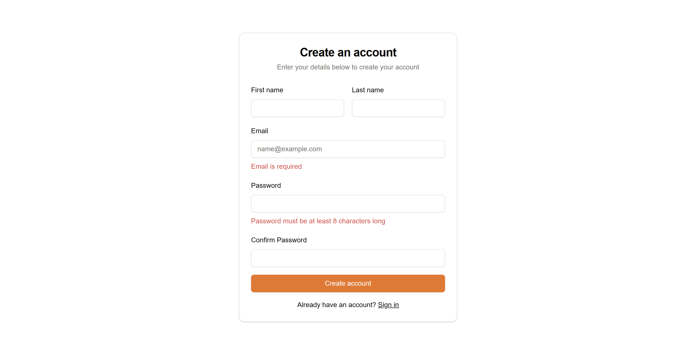

# Task Manager

A modern task management application built with Next.js 15, featuring user authentication, role-based access control, and real-time task management capabilities.

## 🚀 Demo
Visit the live demo: [Task Manager](https://task-manager-snowy-pi.vercel.app/)

## 📸 How The App Works

### Homepage
#### Dark Mode

#### Light Mode

The homepage provides a clean, modern interface introducing users to the task management platform. It features a responsive navigation bar, hero section explaining key features, and quick access to login/register options.

### Authentication Flow
#### Login/Register Page


Users can either login with existing credentials or create a new account. The registration process includes email verification for security.

#### Email Verification


After registration, users receive a verification email to confirm their account, ensuring security and preventing spam accounts.

### Dashboard
#### Dark Mode

#### Light Mode

The dashboard provides an overview of all tasks and events. It features a responsive sidebar for navigation and quick access to different sections.

### Event Management
#### Creating Events

Users can create new events by filling out details such as:
- Event title
- Description
- Date and time
- Location
- Attendees

#### Event View

Once created, events display all relevant information and allow for easy editing and management.

### Task Management
#### Creating Tasks


The task creation interface allows users to:
- Set task title
- Add description
- Add related files

#### Completed Tasks

Completed tasks are marked and can be filtered for easy tracking of progress.

### Attendee Management
#### Adding Attendees

Users can search and add attendees to events with an intuitive interface.

#### Attendee List

View and manage all attendees for each event, with options to remove or add more participants.

### Task Details
#### Task View

Detailed task view showing all task information, progress, and related activities.

#### Full Task Details

Comprehensive view of task details including comments, attachments, and history.

## ✨ Features

### Authentication
- User authentication with email verification
- Password reset functionality
- Role-based access control (Admin/User)

### Task Management
- Create, read, update, and delete tasks
- Real-time search and filtering
- Task organization and categorization

### User Interface
- Responsive design for all devices
- Modern and clean UI with shadcn/ui components
- Dark mode support

## 🛠️ Tech Stack

- [Next.js 15](https://nextjs.org/) - React Framework
- [Auth.js](https://authjs.dev/) - Authentication
- [Prisma](https://www.prisma.io/) - ORM
- [Neon DB](https://neon.tech/) - PostgreSQL Database
- [Tailwind CSS](https://tailwindcss.com/) - Styling
- [shadcn/ui](https://ui.shadcn.com/) - UI Components
- [Zod](https://zod.dev/) - Type Validation
- [Conform](https://conform.guide/) - Form Handling
- [Node Mailer](https://nodemailer.com/) - Email Verification

## 🚦 Getting Started

### Prerequisites
Make sure you have pnpm installed (required for Next.js 15 compatibility):
```bash
npm install -g pnpm